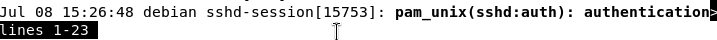
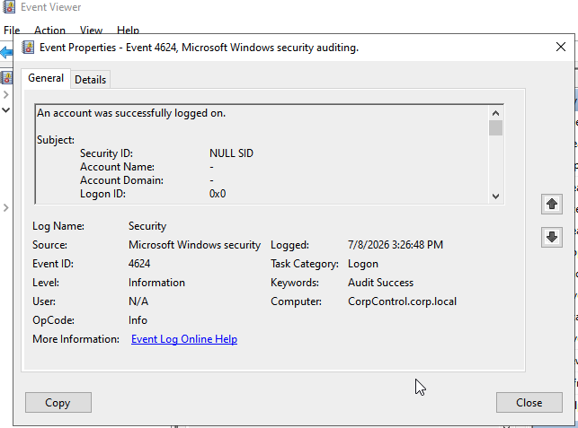
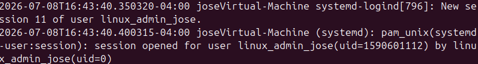
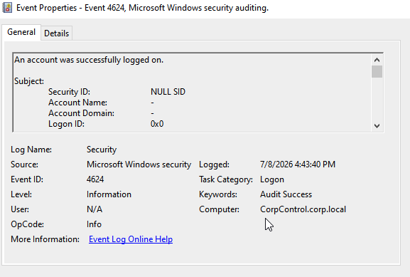
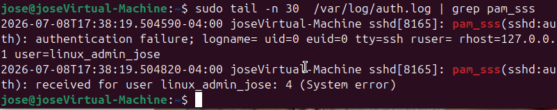
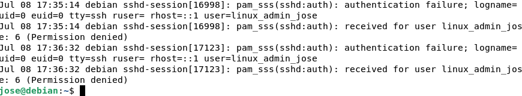

# Project 2: Enterprise Escalation & Active Directory Federation

## Overview
To manage unmaintained endpoints and eliminate localized "fail-open" authentication vulnerabilities, I scaled the lab into a centralized enterprise identity model. This folder contains the configuration blueprints used to integrate heterogeneous Linux nodes into a Windows Server Domain Controller (corp.local) to enforce centralized, real-time administrative access windows (**Logon Hours**).

## Operational Architecture
1. **Identity Plane:** Windows Server Domain Controller managing user accounts and time-restriction matrices.
2. **Integration Agent ([sssd.conf](./sssd.conf)):** Intercepts authentication queries and challenges the DC over Kerberos/LDAP. This exact configuration was deployed identically across both the Ubuntu (WAN) and Debian (LAN) endpoints to establish cross-platform policy parity.
3. **Enforcement Stack ([pam.d/common-account](./pam.d/common-account)):** Hardened local Pluggable Authentication Modules (PAM) structure to handle SSSD response signals and prevent offline bypasses.

## Verification & Forensic Telemetry

### Baseline: Permitted Window Access
Authenticating as a domain user within authorized hours logs in smoothly across the edge nodes, generating clean server-side authentication events matching Active Directory Security Audit Event 4624.

#### Debian Node Authentication Parity
Below is the correlation tracking an active SSH authentication session established on the Debian client node, instantly generating a corresponding centralized successful authentication log on the Windows Domain Controller down to the exact second (15:26:48):

| Linux Local Client Syslog (`/var/log/auth.log`) | Windows Domain Controller Centralized Log (Event 4624) |
| :---: | :---: |
|  |  |

#### Ubuntu Node Authentication Parity
Below is the matching tracking matrix for the Ubuntu client node. The local systemd-logind session initializes at 16:43:40, triggering the real-time Kerberos/LDAP verification event on the Windows DC (CorpControl.corp.local) at the exact identical time marker:

| Linux Local Client Syslog (`/var/log/auth.log`) | Windows Domain Controller Centralized Log (Event 4624) |
| :---: | :---: |
|  |  |

### Enforcement: After-Hours Administrative Lockout
When attempting an interactive login past the authorized window (5:00 PM), the local edge PAM framework evaluates the account parameters pulled by pam_sss, drops the authentication pipeline instantly, and passes back a masked Permission denied error to the terminal.

#### Lockout Telemetry & Audit Trail
Below is the verification showing the system successfully denying access after hours. The client terminal triggers an immediate rejection, while the Windows Domain Controller registers the explicit restriction policy enforcement:

| Linux Client Lockout Terminal | Windows DC Policy Enforcement Log |
| :---: | :---: |
|  |  |
