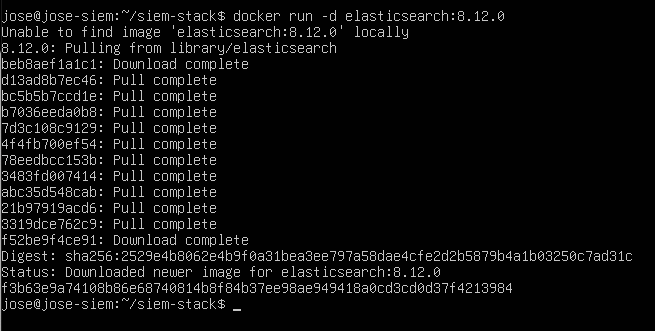
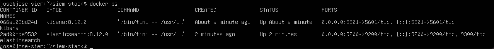
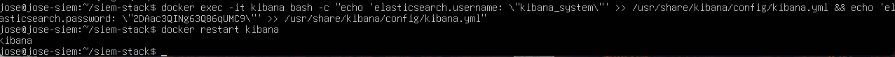
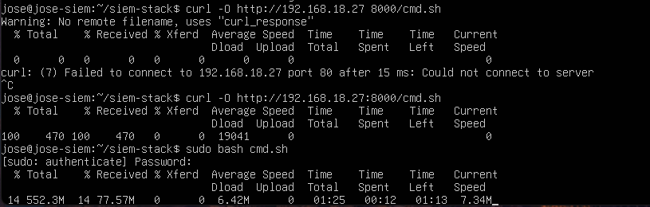
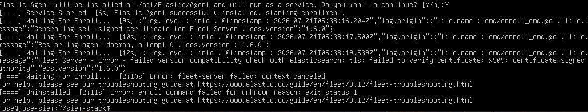
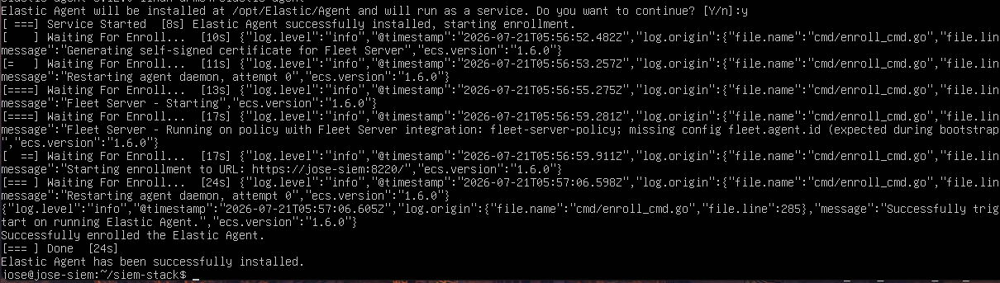
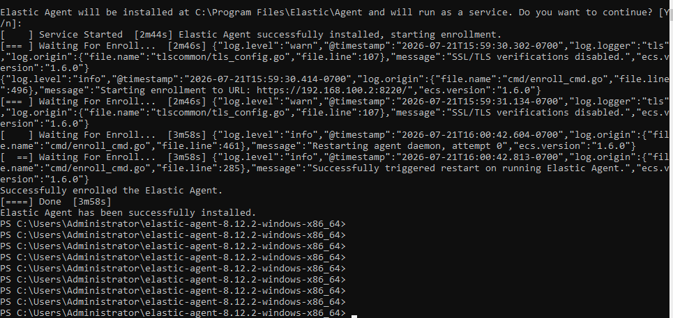
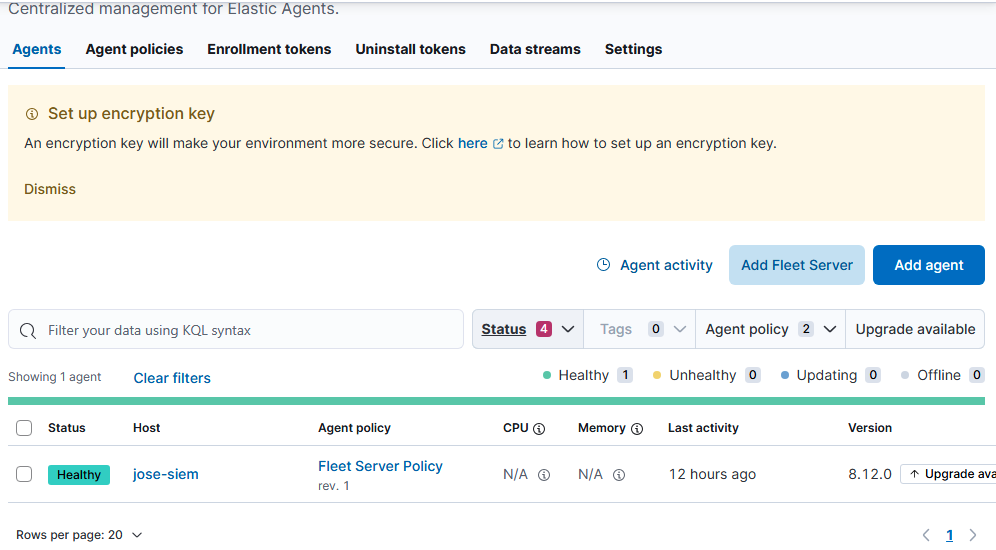
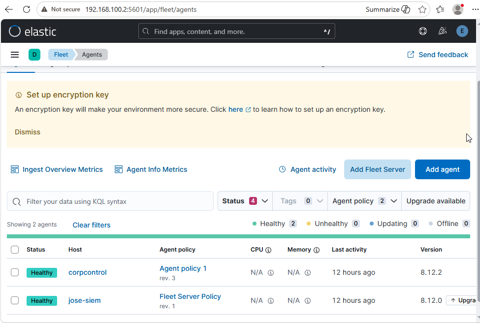
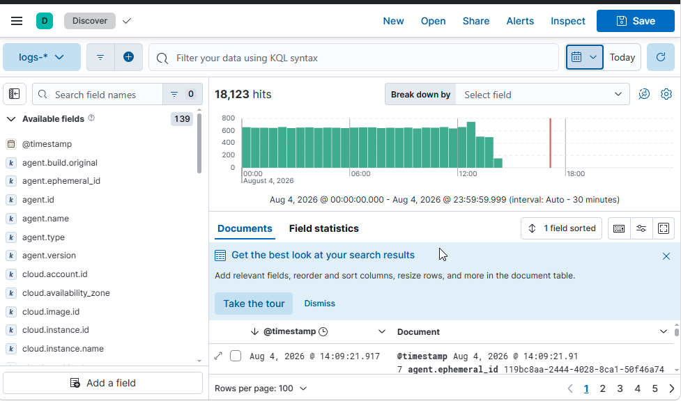

# Enterprise SIEM & Active Directory Telemetry Pipeline

## Overview

To eliminate blind spots across enterprise infrastructure and enable centralized detection capabilities, I expanded the lab environment to include a containerized Security Information and Event Management (SIEM) pipeline. This folder details the deployment of an Elastic Stack (Elasticsearch & Kibana) instance on an Ubuntu Server (`jose-siem`) to aggregate and analyze real-time security events from the Windows Server Domain Controller (`corp.local`).

## Operational Architecture

1. **SIEM Engine & Visualization:** Isolated Elasticsearch and Kibana microservices deployed via Docker to prevent dependency conflicts with the underlying host OS.
2. **Fleet Control Plane:** Centralized Elastic Fleet Server hosted on the SIEM node (`192.168.100.2:8220`) to manage endpoint policies and agent deployments.
3. **Endpoint Telemetry Agent:** Elastic Agent deployed on the Active Directory Domain Controller to extract, package, and forward local Windows Event Logs over TLS.

## Verification & Deployment Telemetry

### Containerized Stack Provisioning

To maintain environment parity, the core SIEM components were pulled and deployed using Docker. An initial deployment failure caused by container naming collisions was remediated by stripping stale instances (`docker rm -f`) and explicitly mapping container links, single-node cluster parameters, and exposed ports (`9200`/`5601`).

| Docker Image Acquisition | Active Container Stack Verification |
| :---: | :---: |
|  |  |

---

### Authentication Wiring & Service Configuration

Kibana service tokens were generated directly within the running Elasticsearch container. Authentication parameters were appended into Kibana’s internal configuration (`kibana.yml`) to establish service-to-service communication.

| Service Token Generation | Configuration Injection |
| :---: | :---: |
|  |  |

---

### Local Payload Delivery & Execution

To avoid formatting errors caused by multi-line installation pipelines in remote shell environments, an HTTP server was initialized on the administrative workstation (`192.168.18.27:8000`). The target host retrieved the Fleet deployment script (`cmd.sh`) directly via `curl`.

| Payload Retrieval via Local Web Server |
| :---: |
|  |

---

### Fleet Server Provisioning & PKI Exception Handling

Initial Fleet Server initialization failed during handshake validation due to self-signed TLS/x509 certificate authorities (`x509: certificate signed by unknown authority`).

To resolve this in the lab environment, the execution string was modified to include the `--fleet-server-es-insecure` flag, overriding strict CA verification and allowing the Fleet daemon to bind to port `8220`.

| TLS Certificate Validation Failure | Active Fleet Daemon Verification |
| :---: | :---: |
|  |  |

---

### Endpoint Enrollment & Fleet Verification

With the Fleet control plane operational, the Elastic Agent was deployed on the Windows Server Domain Controller (`corpcontrol`) via PowerShell. Passing the `--insecure` parameter handled the local PKI override, successfully enrolling the Domain Controller into the Fleet policy.

| Domain Controller Endpoint Enrollment | Fleet Server Host Active |
| :---: | :---: |
|  |  |

---

### Centralized Log Ingestion & Telemetry Verification

With both `jose-siem` and `corpcontrol` reporting healthy statuses back to Fleet, incoming Windows audit logs were verified in the Kibana Discover dashboard, confirming active telemetry streaming across the environment.

| Dual-Agent Fleet Health | Kibana Telemetry Stream Verification |
| :---: | :---: |
|  |  |
